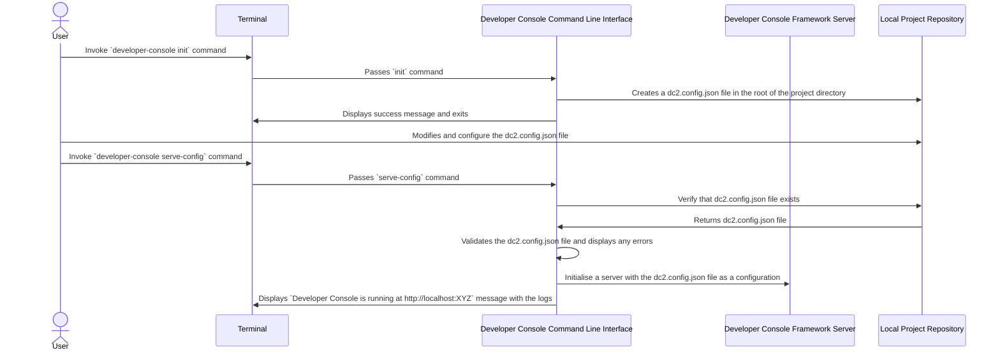
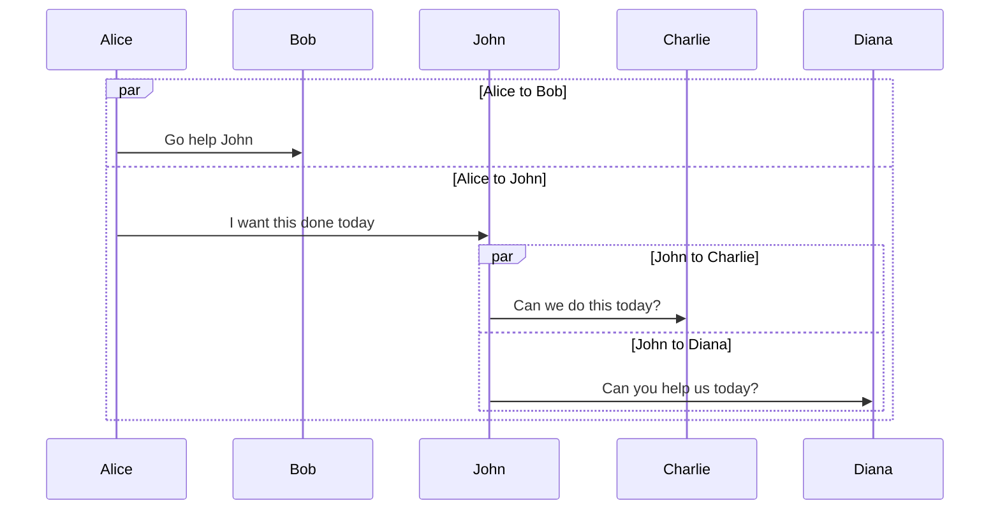

```mermaid
sequenceDiagram
    actor User
    participant Terminal
    participant Developer Console Command Line Interface
    participant Developer Console Framework Server
    participant Local Project Repository

    User->>Terminal: Invoke `developer-console init` command
    Terminal->>Developer Console Command Line Interface: Passes `init` command
    Developer Console Command Line Interface->>Local Project Repository: Creates a dc2.config.json file in the root of the project directory
    Developer Console Command Line Interface->>Terminal: Displays success message and exits

    User->>Local Project Repository: Modifies and configure the dc2.config.json file

    User->>Terminal: Invoke `developer-console serve-config` command
    Terminal->>Developer Console Command Line Interface: Passes `serve-config` command
    Developer Console Command Line Interface->>Local Project Repository: Verify that dc2.config.json file exists
    Local Project Repository->>Developer Console Command Line Interface: Returns dc2.config.json file
    Developer Console Command Line Interface->>Developer Console Command Line Interface: Validates the dc2.config.json file and displays any errors
    Developer Console Command Line Interface->>Developer Console Framework Server: Initialise a server with the dc2.config.json file as a configuration
    Developer Console Command Line Interface->>Terminal: Displays `Developer Console is running at http://localhost:XYZ` message with the logs
```

```mermaid
sequenceDiagram
    par Alice to Bob
        Alice->>Bob: Go help John
    and Alice to John
        Alice->>John: I want this done today
        par John to Charlie
            John->>Charlie: Can we do this today?
        and John to Diana
            John->>Diana: Can you help us today?
        end
    end
```
